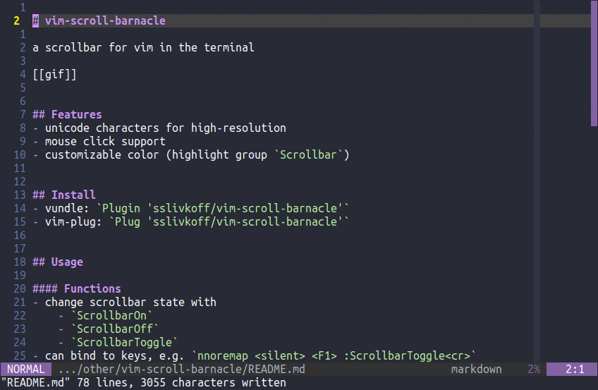

# vim-scroll-barnacle

a scrollbar for vim in the terminal

## Features
- unicode characters for high-resolution
- mouse click support
- customizable colors and glyphs

## Install
- vundle: `Plugin 'sslivkoff/vim-scroll-barnacle'`
- vim-plug: `Plug 'sslivkoff/vim-scroll-barnacle'`

## Usage

#### Functions
- change scrollbar state with
    - `:ScrollbarToggle`
    - `:ScrollbarOn`
    - `:ScrollbarOff`
- can bind to keys e.g. `nnoremap <silent> <F1> :ScrollbarToggle<cr>`

#### Configuration
- can put these in your vimrc, e.g. `let g:sb_default_behavior = "always"`
- `g:sb_default_behavior` whether scrollbar is on by default (default = `"overflow"`)
    - `"always"`: scrollbar always on
    - `"overflow"`: scrollbar on when buffer does not fit in window
    - `"never"`: scrollbar off by default
- `g:sb_bar_style` style to use for scrollbar (default = `"solid"`)
    - `"solid"` solid scrollbar using `▁▂▃▄▅▆▇█`
    - `"left dot"` dot scrollbar using `⠁⠂⠄⡀⠃⠆⡄⠇⡆⡇`
    - `"right dot"` dot scrollbar using `⠈⠐⠠⢀⠘⠰⢠⠸⢰⢸`
    - `"double dot"` dot scrollbar using `⠉⠒⠤⣀⠛⠶⣤⠿⣶⣿`
- `g:sb_patch_mouse` whether to patch mouse for mouse click events (default = `1`)
    - see section below
- `g:sb_patch_keys` whether to patch certain keys for scroll events (default = `1`)
- `Scrollbar` highlight group
    - change scrollbar color using the `Scrollbar` highlight group
    - e.g.
        - `highlight Scrollbar guifg=grey`
        - `highlight link Scrollbar Normal` [default]
        - `highlight link Scrollbar Comment`

## Implementation
- uses floating window, window has filetype `scrollbar`
- [gifine](https://github.com/leafo/gifine) and [vim-smoothie](https://github.com/psliwka/vim-smoothie) used for creating the gif in this readme
- weclome to suggestions, bug reports, and pull requests

## Shortcomings
- Neovim only for now
    - some `nvim_*` functions in the neovim [api](https://neovim.io/doc/user/api.html) were crucial for functionality and efficiency
    - suggestions on how to port to vim welcome
- Can only mouse click, not mouse drag
    - The vim mouse api is very limited
    - Clicking requires patching `<LeftMouse>` input
    - Can disable this patching with `let g:sb_patch_mouse = 0`
- Vim does not emit scroll events directly
    - Most actions that affect the scrollbar can be detected indirectly using vim events (e.g. `CursorMove` and `VimResize`)
    - However, some scroll actions are not detectable with events
    - ScrollBarnacle patches these key combinations so that they can affect the scrollbar: `zz`, `zt`, `zb`, `<C-e>`, `<C-y>`, `<ScrollWheelUp>`, `<ScrollWheelDown>`
    - You can disable this patching with `let g:sb_patch_keys = 0`
- Does not work with tabs
    - This is because there is no way to close floating windows in a tab when it is closed. Attempting to close the window results in an error.
    - A neovim patch is in the works, see [issue](https://github.com/neovim/neovim/issues/11440) and [WIP PR](https://github.com/neovim/neovim/pull/11938)

## Related Projects
- https://github.com/lornix/vim-scrollbar
- https://github.com/gcavallanti/vim-noscrollbar
- https://github.com/drzel/vim-line-no-indicator

